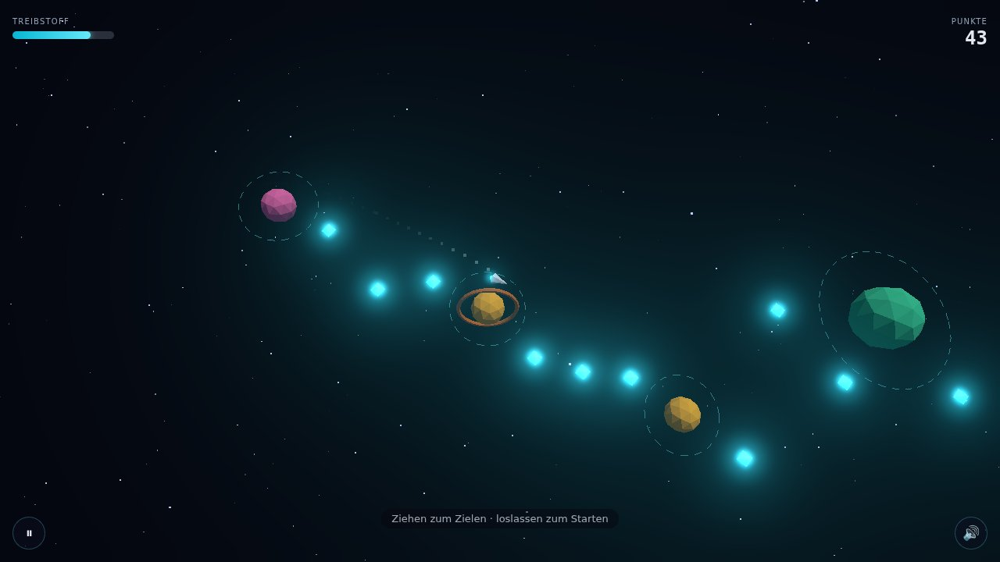

## What it is

An endless arcade game in the browser: a ship sits in orbit, you drag to aim, release, and
gravity does the rest — capture into the next planet's orbit, collect crystals, chain flyby
bonuses, run out of fuel and die. Everything on screen is rendered live with Three.js; there are
no prerendered assets, no backend, no install, and no network access at runtime. On top of the
endless mode there is a **daily challenge** and shareable `?seed=` links, each with a **ghost** of
your best run flying alongside, plus milestone toasts and a synthesized soundtrack. It has been
rendered and played headlessly; the game-feel and frame-rate session on a real GPU is still open.

*Headless software render (SwiftShader, 1280×720) — a real capture, not a statement about GPU
looks or speed.*

## Architecture

- **A pure core with no renderer in it.** `src/core`, `src/physics` and `src/world` import
  neither Three.js nor the DOM. Gravity (k-nearest, inverse-square), the semi-implicit Euler
  integrator, orbit capture, scoring, the phase machine, the seeded world generator and the
  session that drains input events once per frame are all plain functions — which is why 144 unit
  tests can run without a GPU. Everything a run owns is listed in one reset registry whose type
  forces a handler per entry, so a restart cannot forget a piece of state.
- **Fixed-timestep simulation** at 120 Hz with render interpolation and a spiral-of-death clamp,
  so the physics is frame-rate independent.
- **The trajectory preview is not a preview.** It runs the same integrator as the actual flight,
  so the dashed line and the path taken cannot drift apart.
- **Seeded, deterministic world generation** — the corridor of planets, suns and crystals is
  derived from a seed at runtime; nothing is stored or fetched. The daily seed is a hash of the
  UTC date, so a share link is the whole backend.
- **The ghost is a replay, not a recording.** It stores only the launches (at most 50) and re-runs
  them through a second simulation in lockstep; a test hashes per-tick positions, including after
  a JSON round-trip, and a 1e-12 change in input makes the runs diverge.
- **Render layer**: pooled meshes with explicit GPU-buffer disposal on prune, a DOM overlay HUD,
  and WebAudio-synthesized SFX (five oscillator cues, zero audio files, zero licensing).

## Why it's built this way

The interesting engineering claim of a browser game is not the visuals — it is that the
simulation is testable. Splitting pure logic from rendering made the whole gameplay layer
verifiable in CI on a machine with no display, which is the only reason an autonomous build loop
could work on it at all. The stack is deliberately framework-free: vanilla Three.js over React
Three Fiber or Babylon.js, for direct control of the game loop and a small bundle.

## Implementation

- `npm run gate` (typecheck + Vitest + ESLint) is the objective done-check; nothing was committed
  red. Current state: **144 tests** (80 at v1), clean typecheck and lint.
- **Rendering it found four bugs the tests could not.** Headless Chromium with software WebGL and
  real mouse input: the preview drifted while the pointer was held still, every launch counted as
  a free flyby (+400 × multiplier, stacking), the dev fps overlay divided by CPU time instead of
  frame time, and a mid-round change froze the simulation because `ghost?.advance(session.advance(dt))`
  skips evaluating its argument when there is no ghost — caught before it was committed.
- Production build is **149.87 kB gzip** in three chunks (app 11.43, three-core 50.92, three
  87.52) against a self-imposed 500 kB budget. The split costs about 1.2 kB over the old single
  145 kB chunk, so the plan's "not larger" acceptance is stated as missed rather than bent.
- **A test that could not fail was caught by mutation-checking it.** The first draft of the
  difficulty-ramp test recomputed its expectations from the same constants the generator uses —
  swapping two of those constants in the generator still left the test green. It was rewritten to
  read real generator output, then re-verified against two deliberate mutations.
- **The gravity hot path was rewritten only once it could be proven equal.** Top-K selection now
  inserts into reused typed arrays instead of copying and sorting — 5.8× faster in a micro-benchmark,
  and a golden test over 2,000 randomised body sets plus a 3,000-step flight shows bit-identical
  results. A CPU profile of the running game then showed the main thread ~97 % idle, so a further
  micro-optimisation that measured as noise was not committed.

## Trade-offs & what I considered

- **Headless has a hard ceiling.** Software rendering runs at 6–10 fps at 1280×720 — explicitly
  not a GPU number. Game feel, looks, touch ergonomics, the audio mix and real fps stay open for a
  session on real hardware, together with the choice between four visual themes and the name.
- **Reachability is now tested, not assumed.** A search over orbit angle, 32 directions and five
  launch powers finds every one of 2,000 gaps (50 seeds × 40) reachable. Doubling the spacing
  still breaks nothing, so the permanent guard is a deliberately unreachable void-gap fixture that
  the test must flag.
- **Frustration avoided by design**: planets always capture, hazards are suns and void drift, and
  there is no mid-flight thrust — v1 is a pure slingshot.
- **Deployment is wired but inert** — a GitHub Pages workflow exists (its action pins are
  unverified until a first real run), so the hosted version is not live yet.
